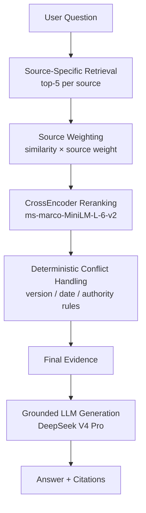

# CloudBox Multi-Source RAG for Technical Support

Grounded technical support answers for CloudBox, built from three knowledge
sources — **product documentation**, **customer forums** and **technical
blogs**. The system retrieves evidence across all sources, ranks it through
source-aware retrieval, reranking and deterministic conflict handling, and
generates a cited answer strictly from the final evidence.

## Architecture



- **Source-Specific Retrieval** — each source is queried separately and the
  hits are merged into one candidate pool (top-5 per source).
- **Source Weighting** — each hit's similarity score is scaled by its source
  type's weight before the pool is cut to 12 candidates.
- **CrossEncoder Reranking** — a second relevance pass re-sorts the pool and
  keeps the final evidence (up to 6 chunks).
- **Deterministic Conflict Handling** — outdated or contradictory community
  evidence is suppressed by explicit rules (no LLM judging); current
  documentation is never overridden.
- **Grounded LLM Generation** — the model answers only from the kept evidence
  and cites it with `[n]` markers; a local citation-mapping step resolves
  every marker back to the real chunk, so the model cannot invent sources.

## Multi-Source Strategy

### Source-Specific Chunking

40 source items → 90 chunks, using the chunking that matches each format:
documentation by `##` section (over-long sections split by paragraph), forums
by whole Q&A thread, blogs by `##` section with paragraph-level splitting.

### Multi-Source Retrieval

Retrieval runs per source and the results are merged into a shared candidate
pool, rather than mixing all sources into one index.

### Source-Aware Weighting

| Source | Weight |
|---|---|
| documentation | 1.0 |
| blog | 0.9 |
| forum | 0.7 |

`weighted_score = similarity × source_weight` — sources have different
authority, so the retrieval score takes the source type into account.

### CrossEncoder Reranking

The candidate pool gets a second-stage relevance ranking with
`cross-encoder/ms-marco-MiniLM-L-6-v2`, re-scoring every (question, chunk)
pair instead of relying on embedding similarity alone.

### Deterministic Conflict Handling

Conflicts are resolved by explicit rules — version, date and source
authority — never by the LLM: blogs from before the current CloudBox version
and pre-release forum threads are suppressed, documentation is never
suppressed, and kept community chunks that overlap with current docs are
flagged as community-authority candidates.

### Grounded Generation

The LLM sees only the final evidence plus the question, and answers with
`[n]` citations. The citation mapping is computed locally against the kept
evidence, so a citation can never point at a suppressed or invented chunk.

## Evaluation

All numbers below come from `scripts/evaluate.py` on a **fixed set of 12
hand-written technical-support queries** with strict ground-truth clause
matching — a small internal evaluation set for regression checks, not a
large-scale benchmark. The final system runs DeepSeek V4 Pro (thinking
disabled); OpenRouter free models were used as an early development baseline
and remain supported as an optional fallback provider.

### Final System

| Metric | Result |
|---|---|
| Hit@5 | 12/12 (100%) |
| MRR@5 | 0.917 |
| Correct / Partially Correct / Incorrect | 9 / 3 / 0 |
| Strict Answer Accuracy | 75% |
| Citation Validity | 32/32 valid (100%) |

*Strict Answer Accuracy on the 12-query evaluation set: 75% — every
substantive ground-truth clause must appear in the answer to count as
Correct.*

### Retrieval Stage Improvement

| Pipeline stage | Hit@5 | MRR@5 |
|---|---|---|
| Raw retrieval | 11/12 | 0.556 |
| + Source weighting | 11/12 | 0.792 |
| + CrossEncoder reranking | 12/12 | 0.764 |
| + Conflict handling (final) | 12/12 | 0.917 |

Source weighting, CrossEncoder reranking and conflict handling are the
mechanisms that improve retrieval ranking stage by stage.

## Quick Start

### Environment

```bash
conda activate cloudbox-rag   # Python 3.11, dependencies in requirements.txt
```

### API Key

Create `.env` in the project root:

```
DEEPSEEK_API_KEY=your_key_here
```

`.env` is gitignored; see `.env.example` for the template. An
`OPENROUTER_API_KEY` is accepted as an optional fallback provider.

### Build the Index (first run)

```bash
python scripts/ingest.py
```

Idempotent — loads, chunks and embeds the 90 knowledge chunks into the local
ChromaDB collection (`chroma_db/`, gitignored).

### Run the Demo

```bash
run_demo.bat                            # Windows: double-click launcher
python -m streamlit run app.py          # or run directly
```

### CLI

```bash
python main.py "How much free storage do I get with CloudBox?"
python main.py --debug "Is two-factor authentication required?"
python main.py --sources blog "What are best practices for team folders?"
```

`--debug` prints the full RAG trace (evidence, conflict decisions, citations).

### Evaluation

```bash
PYTHONPATH=. python scripts/evaluate.py
```

Runs the 12-query evaluation with real LLM calls; results land in
`outputs/eval_results/results.json`.

## Demo

The Streamlit demo (`app.py`) is a presentation interface over the finished
pipeline — it provides:

- source filter (All Sources / Documentation / Forums / Blogs)
- question input with one-click Ask
- the grounded answer with `[n]` citations preserved
- source cards for every cited chunk (type, title, snippet)
- an optional collapsed RAG trace showing per-chunk scores, conflict
  decisions and the final evidence

## Project Structure

| Path | What it is |
|---|---|
| `app.py` | Streamlit demo UI |
| `run_demo.bat` | one-click Windows launcher for the demo |
| `main.py` | CLI: answer, `--debug` trace, per-stage views |
| `src/` | the RAG pipeline: config, loaders, chunking, retrieval, weighting, reranking, conflict handling, answer generation |
| `scripts/` | `ingest.py` (build the index), `evaluate.py` (12-query evaluation) |
| `data/` | knowledge sources (docs / forums / blogs) and the evaluation queries |
| `tests/` | 100 unit / regression / UI tests |
| `outputs/` | evaluation results (gitignored) |
| `chroma_db/` | local vector store (gitignored, rebuilt by `ingest.py`) |
