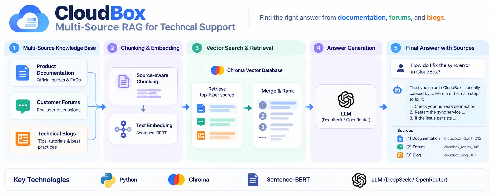

# CloudBox Multi-Source RAG for Technical Support



CloudBox is a fictional cloud storage product similar to Dropbox. This project builds a multi-source support RAG agent that answers user questions using three knowledge sources: **official product documentation**, **customer forums**, and **technical blogs**.

The sources have different levels of authority and may contain outdated or conflicting information. The system is designed to retrieve relevant evidence, rank it carefully, resolve conflicts, and generate answers with traceable citations.

---

## Knowledge Sources & Chunking

The knowledge base contains **40 source items → 90 searchable chunks**.

Different sources use different chunking strategies based on their structure.

| Source | Content | Chunking Strategy |
|---|---|---|
| **Documentation** | Official product information | Split by `##` section; long sections split by paragraph |
| **Forums** | Customer questions and discussions | Keep each Q&A thread together |
| **Blogs** | Tutorials and technical posts | Smaller section-based chunks |

Documentation sections usually represent one complete product topic, while forum questions and answers are kept together to preserve their context.

---

## How the RAG Pipeline Works

> **User Question → Source-Specific Retrieval → Source Weighting → CrossEncoder Reranking → Deterministic Conflict Handling → Final Evidence → Grounded LLM Generation → Answer + Citations**

### 1. Multi-Source Retrieval

Instead of searching all sources together, the system retrieves from **documentation, forums, and blogs separately**.

By default, it retrieves the **top-5 results from each source** before merging them into a shared candidate pool.

### 2. Source-Aware Weighting

Different sources have different levels of authority:

| Source | Weight |
|---|---:|
| Documentation | **1.0** |
| Blog | **0.9** |
| Forum | **0.7** |

```text
weighted_score = similarity × source_weight
```

Embedding similarity measures how relevant a chunk is to the question, while source weighting also considers how much that type of source should be trusted.

### 3. CrossEncoder Reranking

The candidate pool is reranked using:

`cross-encoder/ms-marco-MiniLM-L-6-v2`

The initial embedding search provides fast candidate retrieval. The CrossEncoder then scores each **(question, chunk)** pair directly for more precise relevance ranking.

### 4. Deterministic Conflict Handling

> **The most relevant result is not always the most trustworthy result.**

Conflicts are resolved using explicit **source authority, version, and date rules** before generation.

- outdated blogs can be suppressed
- old forum information can be suppressed
- current documentation is preserved
- conflicting community evidence can be flagged
- the LLM does **not** decide which source wins

Only the final kept evidence is sent to the LLM.

This separates **semantic relevance** from **source trust and conflict resolution**.

### 5. Grounded Generation

DeepSeek generates the final answer using only the kept evidence.

Answers contain `[n]` citations, which are mapped locally back to the actual retrieved chunks.

---

## Does the Retrieval Strategy Actually Help?

The system is evaluated on a fixed set of **12 hand-written technical-support questions**.

Each query contains expected chunk IDs grounded in the original CloudBox knowledge sources.

- **Hit@5** — Did the correct evidence appear in the top 5?
- **MRR@5** — How close to the top was the first correct result?

### Retrieval Stage Improvement

| Pipeline Stage | Hit@5 | MRR@5 |
|---|---:|---:|
| Raw Retrieval | 11/12 | 0.556 |
| + Source Weighting | 11/12 | 0.792 |
| + CrossEncoder Reranking | 12/12 | 0.764 |
| + Conflict Handling (Final) | **12/12 (100%)** | **0.917** |

The stage-by-stage comparison shows how source weighting, reranking, and conflict handling change the final evidence ranking.

### Final Answer Quality

| Metric | Result |
|---|---:|
| Hit@5 | **12/12 (100%)** |
| MRR@5 | **0.917** |
| Fully Correct | **9/12** |
| Partially Correct | **3/12** |
| Incorrect | **0/12** |
| Strict Answer Accuracy | **75%** |
| Citation Validity | **32/32 (100%)** |

Final answer correctness was manually reviewed against predefined answer facts verified from the original source data.

The main remaining gap is **generation completeness**: in the partially correct cases, the relevant evidence was retrieved, but the generated answer omitted some required details.

> This is a small internal evaluation set for regression testing, not a large-scale benchmark.

---

## Top-K Tradeoff

Different retrieval depths were tested to check whether performance improved simply by retrieving more candidates.

| K | Final Hit@K | Final MRR@K | Final Precision@K |
|---:|---:|---:|---:|
| 1 | 4/12 | 0.333 | 0.333 |
| 3 | **12/12** | **0.917** | **0.389** |
| **5 (default)** | **12/12** | **0.917** | 0.233 |
| 10 | **12/12** | **0.917** | 0.125 |

**K=1** is too restrictive and misses useful evidence.

**K=3 and K=5** both achieve full retrieval coverage on this evaluation set.

Increasing to **K=10** does not improve the final Hit rate or MRR, while introducing more irrelevant results.

The default **K=5** is a conservative engineering choice that provides a small recall safety margin without making the candidate set unnecessarily large.

---

## Demo

The Streamlit interface exposes the final answer, citations, source cards, and an optional full RAG trace.

### 1. Simple Fact Retrieval

> **How long are deleted files kept?**

A basic factual retrieval case: find the correct retention policy and answer with traceable evidence.

### 2. Multi-Part Retrieval

> **Can I share files with someone who doesn't have a CloudBox account, and what controls do I have over the shared link?**

The system needs to retrieve multiple pieces of information, including external-user access, permissions, expiration, and password protection.

### 3. Conflicting Sources

> **How much free storage do I get with CloudBox?**

The knowledge base intentionally contains conflicting information:

| Source | Information | Status |
|---|---:|---|
| Old Blog | **5 GB** | Suppressed |
| Old Forum | **15 GB** | Suppressed |
| Current Documentation | **10 GB** | Kept |

In an actual retrieval run, the CrossEncoder ranked the incorrect **15 GB forum result above the correct documentation result**.

This demonstrates why semantic relevance alone is not enough.

The conflict-handling layer detects outdated evidence before generation, and the final answer uses the current **10 GB** documentation.

---

## Limitations & Future Work

- **Larger evaluation** — move beyond 90 chunks and 12 evaluation queries to larger, more realistic datasets.
- **Hybrid retrieval** — combine dense embeddings with BM25 for exact technical terms, error codes, and product names.
- **Scalable conflict detection** — replace some manually defined rules with richer metadata and structured conflict detection as the knowledge base grows.

---

## Why This Matters Beyond CloudBox

The same source-authority problem becomes more important in high-stakes domains such as healthcare.

Older information may conflict with newer guidelines, and an LLM should not be solely responsible for deciding which source to trust.

A production system in such a domain could add:

- stronger source and version control
- better evidence verification
- human review for high-risk questions
- stronger traceability and auditing

> **Retrieve the right information, resolve important conflicts before generation, and keep every answer traceable to its evidence.**

---

## Quick Start

### Environment

```bash
conda activate cloudbox-rag
```

Python 3.11; dependencies are listed in `requirements.txt`.

### API Key

Create `.env` from `.env.example`:

```text
DEEPSEEK_API_KEY=your_key_here
```

`.env` is gitignored.

### Build the Index

```bash
python scripts/ingest.py
```

This loads, chunks, and embeds the **90 knowledge chunks** into the local ChromaDB collection.

### Run the Demo

```bash
python -m streamlit run app.py
```

Or on Windows:

```bash
run_demo.bat
```

The Streamlit demo supports source filtering, grounded answers with citations, source cards, and an optional full RAG trace.